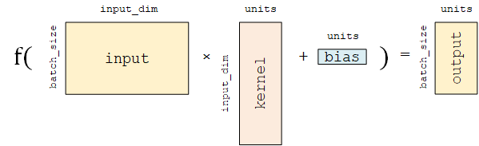

## TensorFlow

### . 基础
* tf.Variable(): 初始化定义张量(方法`shape` 、 `dtype` 属性和 `numpy()`);  
    定义一个随机数（标量）`tf.Variable(tf.random.uniform(shape=()))`
    定义一个有2个元素的零向量`tf.zeros(shape=(2))`  
    variable定义的张量要初始化
* tf.constant():定义常量，常量运算 和：tf.add(A, B)、积：tf.matmul(A, B)
* tf.GradientTape(): 求导记录器 来实现自动求导

### . 模型建立与训练
* 模型的构建： tf.keras.Model 和 tf.keras.layers
* 模型的损失函数： tf.keras.losses
* 模型的优化器： tf.keras.optimizer
* 模型的评估： tf.keras.metrics  
  
* 全连接层(tf.keras.layers.Dense): 对输入矩阵A进行f(AW + b) 的线性变换和激活函数操作。如果不指定激活函数，即是纯粹的线性变换 AW + b。给定输入张量input = 给定输入张量 input = [batch_size, input_dim] ，该层对输入张量首先进行 tf.matmul(input, kernel) + bias 的线性变换（ kernel 和 bias 是层中可训练的变量）  
`units `：输出张量的维度；  
`activation `：激活函数，对应于 f(AW + b) 中的 f ，默认为无激活函数（ a(x) = x ）。常用的激活函数包括 tf.nn.relu 、 tf.nn.tanh 和 tf.nn.sigmoid ；  
`use_bias `：是否加入偏置向量 bias ，即 f(AW + b) 中的 b。默认为 True ；  
`kernel_initializer 、 bias_initializer `：权重矩阵 kernel 和偏置向量 bias 两个变量的初始化器。默认为 tf.glorot_uniform_initializer 1 。设置为 tf.zeros_initializer 表示将两个变量均初始化为全 0；
  
